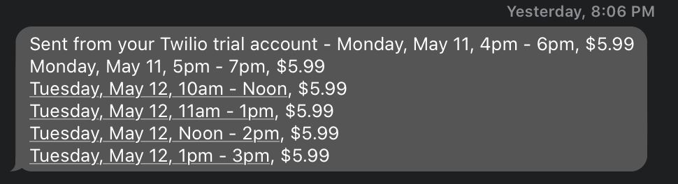

# grocer-notifier

This app is an example project using the [Grocer](https://github.com/itsjohnward/grocer) package.

It simply polls your grocer of choice and sends a text message to the number you provide if delivery times are available.

## To install:

```py
$ pip install git+https://github.com/itsjohnward/grocer-notifier
```

### Getting a ChomeDriver

1. Download ChromeDriver from here https://chromedriver.storage.googleapis.com/index.html?path=83.0.4103.39/
2. Set an environment variable pointing to where you downloaded it. i.e. `export CHROMEDRIVER_PATH=/Users/john/csci-e-29/grocer/chromedriver`

### Setting up account info

Set your instacart username and password as environment variables like so:

```sh
export EMAIL=example@example.com
export PASSWORD=password
```

## To run:

1. Make sure you have a [Twilio developer account](www.twilio.com/referral/DHYJ5M) set up, and then set your app keys:

```sh
$ export TWILIO_PHONE_NUMBER=+12345678910
$ export TWILIO_ACCOUNT_SID=putyourshere
$ export TWILIO_AUTH_TOKEN=putyourshere
```

2. Try running it:

```sh
$ grocerytime wegmans 1245678910
```

It should output a formatted message to the console. Once you're happy with how it's configured, you can turn on text messages by setting the following environment variable:

```
$ export TWILIO_PROD_MODE=TRUE
```

Then, you should start getting text messages, that look like this:


